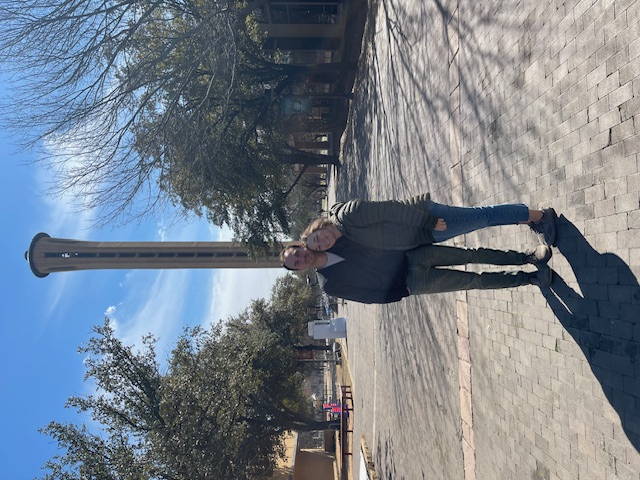

# About me

I am an early-career mathematician working in numerical analysis and 
specializing in nonlinear solvers. I earned 
my PhD from the University of Florida in May 2024 under the suprvision of 
[Dr. Sara Pollock](https://people.clas.ufl.edu/spollock/). The topic of my 
[dissertation](https://ufdc.ufl.edu/en/UFE0060881/00001/pdf) was the analysis of [Anderson acceleration](https://en.wikipedia.org/wiki/Anderson_acceleration) applied to singular problems and its applications to 
parameter-dependent nonlinear PDEs. Since Fall 2024, I have been a postdoctoral teaching fellow in mathematics at the [University of Dallas](https://udallas.edu/) in Irving, Texas. Here, I've had the privilege to develop my teaching skills and gain experience with inquiry-based learning. 

My wife and I by the University of Dallas' bell tower.

<!-- width="275" height="350" -->  

